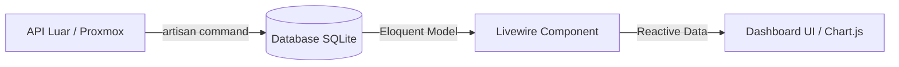

# Panduan Integrasi API & Data Nyata

Dokumen ini menjelaskan di mana tim pengembang meletakkan kode untuk integrasi API dan bagaimana menghubungkan data tersebut ke Frontend dashboard.

## 1. Integrasi API Backend (`app/Services`)

uda ada *Service Layer* terpisah untuk setiap sumber data:

- **Proxmox:** [ProxmoxApiService.php](file:///c:/Users/Dell/Maintenance%20Dashboard/maintenance-dashboard/app/Services/ProxmoxApiService.php)
    - Gunakan file ini untuk menambah logika penarikan data VM, Node, atau resource history.
    - Fungsi utama: `getAllVMs()`, `getVMStatus()`, `parseVMData()`.
- **Nextcloud / Lainnya:** [NextcloudApiService.php](file:///c:/Users/Dell/Maintenance%20Dashboard/maintenance-dashboard/app/Services/NextcloudApiService.php)
    - Letakkan logika `Http::get()` atau `Http::post()` di sini. Gunakan *Basic Auth* atau *Bearer Token* sesuai kebutuhan API.

## 2. Sinkronisasi Data (`app/Console/Commands`)

Untuk menjaga performa dashboard agar tetap cepat, data ditarik secara berkala (misal tiap 5-15 menit) dan disimpan ke database:

- Gunakan perintah `php artisan proxmox:sync-vms` untuk sinkronisasi data Proxmox.
- Anda dapat membuat perintah baru misal `php artisan nextcloud:sync-stats` untuk menarik data statistik secara otomatis.

## 3. Menampilkan Data di Frontend (Livewire)

Frontend menarik data dari Database (Eloquent Model), bukan langsung dari API saat halaman dimuat (agar tidak lambat).

- **Komponen Livewire:** Lihat [app/Livewire/](file:///c:/Users/Dell/Maintenance%20Dashboard/maintenance-dashboard/app/Livewire/)
    - Contoh [VMUsageCard.php](file:///c:/Users/Dell/Maintenance%20Dashboard/maintenance-dashboard/app/Livewire/VMUsageCard.php): Komponen ini mengambil data dari model `VirtualMachine`.
- **Grafik (Charts):** Lihat [UsageTrendChart.php](file:///c:/Users/Dell/Maintenance%20Dashboard/maintenance-dashboard/app/Livewire/UsageTrendChart.php)
    - Untuk membuat data menjadi nyata, ubah property `$usageData` agar mengambil data dari model statistik di database.
    - Gunakan `wire:poll` pada blade untuk *real-time update*.

## 4. Aliran Data (Workflow)

---

**Tempat Meletakkan Kode Baru:**
- **Logika API:** `app/Services/`
- **Tabel Baru:** `database/migrations/`
- **Model Data:** `app/Models/`
- **Tampilan Dinamis:** `app/Livewire/` & `resources/views/livewire/`
